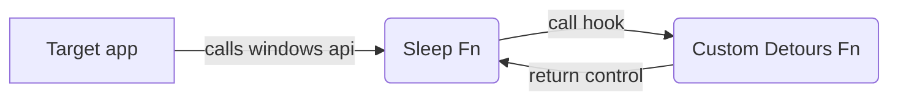

# Microsoft Detours Novice Guide


A complete tutorial on how to use the https://github.com/microsoft/Detours package to hook windows applications

Detours is a fantastic package by Microsoft to hook into any Win32 APIs used by Windows Applications (Apps, Games). There were of course other ways to
do it even before this existed, however detours makes it simpler to do so (well not at first, which is why I wrote this guide).

## Basic Idea

The idea is simple, whenever an windows application makes a system call or uses a system function, we want to intercept that call and possibly execute
our own code before returning control to the target application. Some common uses of this would be to hot patch applications or games (yes you can do that too).

There are four major items to consider -
- Identify target process 
- Identify which function call (from the target process) to hook
- Writing the custom code with same function signature with the help of detours
- Injecting the code into the target process

## Pre requisite 
[MS Visual Studio](https://visualstudio.microsoft.com/downloads/) (any version, you can get community edition for free)

## Getting started


We will be using the beginner code from the detours [wiki](https://github.com/microsoft/detours/wiki/Using-Detours) with some minor changes to make it work.

### Target application

For our target application, I will just build a C++ console app in Visual Studio which calls the windows [Sleep()](https://learn.microsoft.com/en-us/windows/win32/api/synchapi/nf-synchapi-sleep) function.

```cpp
#include <iostream>
#include <windows.h>
#include <synchapi.h>

int main()
{
    std::cout << "Calling Sleep Fn !\n";
    Sleep(DWORD(2000));
    std::cout << "Done with Sleep Fn !\n";
    getchar();
}
```
You can find the entire code in this repo. Select `Build` and it will produce the `exe` file in
the output directory.

### Target Function
Since our app will call the Sleep fn, let's use the same function to demonstrate our hook !

### Building Detours
Okay, before we use detours, we need to build it to get the library files which we can then use in our project.
Let's clone the [repo](https://github.com/microsoft/Detours) to our local computer

Now we need to build detours based on the architecture of your computer which could be x86 (32 bit) or x64 (64 bit) or arm. I will be building it
for x64 since that's what I have. (Most Intel CPUs are x64 unless very old and AMD CPUs would be ARM)

When you install visual studio you will get some certain commandline shortcuts which you can use directly to configure your environment vars before
building detours. It is mentioned [here](https://github.com/microsoft/detours/wiki/FAQ#where-can-i-find-detourslib-and-detoursh) as step no 1.

Since my computer arch is x64, I will use the `x64 Native Tools Command Prompt for VS` shortcut. You can directly search for it using the windows search.
Now navigate to the detours directory, and run `nmake`

After this, you should have a few folders created in the detours main directory namely `include` and `lib.x64`

### Creating a hooking DLL

Now that we have our detours files which we reference and use in our code, let's build our hook

Consider the example from [wiki](https://github.com/microsoft/detours/wiki/Using-Detours) which targets any application which calls the Sleep fn. 
Since we already build our application which calls the same, we can proceed with this example.

Here comes the important part, in order to intercept/hook into a function, we need it's exact signature since that's how detours would identify the target fn and replace 
it with our hooked fn.

So looking at [Sleep()](https://learn.microsoft.com/en-us/windows/win32/api/synchapi/nf-synchapi-sleep) definition, it's signature is 
```cpp
void Sleep(
  [in] DWORD dwMilliseconds
);
```
The return type is `void` and it takes one param with the type `DWORD`

Detours needs a pointer to this fn to identity it
```cpp
static VOID (WINAPI * TrueSleep)(DWORD dwMilliseconds) = Sleep;

// VOID for return type
// DWORD for param
// (WINAPI *) for pointer type
// TrueSleep for pointer name
// Sleep actual fn referenced from <windows.h>
```


Now, onto the actual hook ! Say we want to print a message to console whenever the Sleep fn gets called in the target process
Notice the same signature.
What we are doing here is simply printing a message to the console before returning control to the original sleep fn
referenced via `TrueSleep` pointer we created
```cpp
VOID WINAPI TimedSleep(DWORD dwMilliseconds)
{
    std::cout << "Hooked\n";
    TrueSleep(dwMilliseconds);
}
```

The full code is below

```cpp
#include <windows.h>
#include <detours.h>
#include <iostream>

static LONG dwSlept = 0;

// Target pointer for the uninstrumented Sleep API.
//
static VOID (WINAPI * TrueSleep)(DWORD dwMilliseconds) = Sleep;

// Detour function that replaces the Sleep API.
//
VOID WINAPI TimedSleep(DWORD dwMilliseconds)
{
    std::cout << "Hooked\n";
    TrueSleep(dwMilliseconds);
}

// DllMain function attaches and detaches the TimedSleep detour to the
// Sleep target function.  The Sleep target function is referred to
// through the TrueSleep target pointer.
//
BOOL WINAPI DllMain(HINSTANCE hinst, DWORD dwReason, LPVOID reserved)
{
    if (DetourIsHelperProcess()) {
        return TRUE;
    }

    if (dwReason == DLL_PROCESS_ATTACH) {
        DetourRestoreAfterWith();
        DetourTransactionBegin();
        DetourUpdateThread(GetCurrentThread());
        DetourAttach(&(PVOID&)TrueSleep, TimedSleep);
        DetourTransactionCommit();
    } else if (dwReason == DLL_PROCESS_DETACH) {
        DetourTransactionBegin();
        DetourUpdateThread(GetCurrentThread());
        DetourDetach(&(PVOID&)TrueSleep, TimedSleep);
        DetourTransactionCommit();
    }
    return TRUE;
}
```

#### Add dependencies

There are few things to take care of, before it works. First we need to add the reference to the detours
header and lib files we built in the building detours step.

- Click on Project -> Properties -> C/C++ -> General -> Include additional directories -> Select the `include` folder from the detours folder
- Click on Project -> Properties -> Linker -> General -> Include library directories -> Select the `lib.64` folder from detours

#### Configure project as DLL

Since we would be injecting our custom detours code into the target application, the best way to do it
is via a DLL.
-  Click on Project -> Properties -> General -> General Properties -> Configuration Type -?> Set as 

Time to build our application ! Click on `Build` in Visual Studio on the top bar and it shall produce a DLL in the repo
directory under the x64 folder.

### Injecting the hook

We got our custom hook DLL and we have got our target application which we wrote before, all we need now is a
way to bind these two together. In other words, we need the target application to load our custom DLL in 
order for this to work. That's the basic principle of hooking, we make the target process load our custom DLL in it's
own process memory and then execute our code.

Fortunately detours already provides a way to do this via the with [withdll](https://github.com/microsoft/Detours/tree/main/samples/withdll) 
app.

At first glance, it looks simple. We should be able to run it by using the following command
`withdll /d:custom_hook.dll target_app.exe`
But doing so throws the error
`DLL does not contain a exported function with ordinal #1.` 
A little digging into the withdll project reveals the fn [DetourCreateProcessWithDllEx](https://github.com/microsoft/detours/wiki/DetourCreateProcessWithDllEx)
which it uses. Since I am a noob in C++, it took me some time to realize that the DLLMain() function we wrote
in our custom hook actually needs to be exported for it to work.

### Modifying our custom hook

Let's export our function by making a slight change
`__declspec(dllexport) BOOL WINAPI DllMain(HINSTANCE hinst, DWORD dwReason, LPVOID reserved)`
Yup that's the only change we need.

Now run the command again !

```console
withdll /d:custom_hook.dll target_app.exe
```

You will see the following output
```console
Calling Sleep Fn !
Hooked
Done with Sleep Fn !
```

Voila our hook works :)

Now that you a taste of what detours can do, I am sure you can find many interesting applications for it !

